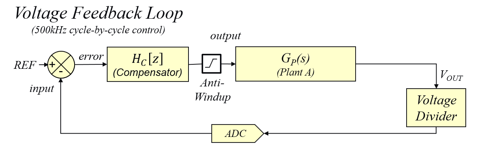

# Power Supply Control

  <!-- start tag for internal references -->

    

### DPSK3 Boost Converter Voltage Mode Control Loop Implementation

    

_________________________________________________
(c) 2021, Microchip Technology Inc.
