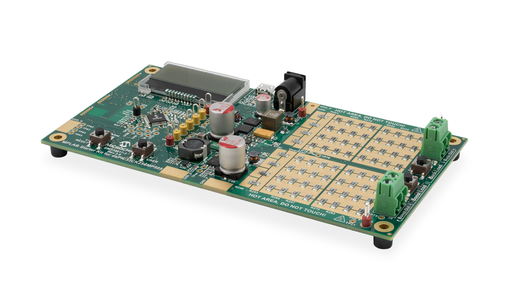

 

--- 
## dsPIC33C Digital Power Starter Kit
### Asynchronous Boost Converter: Voltage Mode Control

<a target="_blank" href="https://www.microchip.com/DM330017-3" rel="nofollow">

&nbsp; 

 
dsPIC33C Digital Power Starter Kit (DPSK3) (Part-No. DM330017-3)
</a>

- - -

## Summary
Voltage mode control example for the boost converter on the Digital Power Starter Kit, version 3 (DPSK3) featuring the dsPIC33CK family of devices.

- - -

## Description
This code example demonstrates the implementation of a simple voltage mode control loop for the synchronous boost converter. The loop implementation also includes the required state machine managing board status analysis, start-up control, operation monitoring, fault handling and auto-restart capability. The boost converter state machine is based on a generic library package, which is configured and run in user code.

This code example also includes the LCD driver allowing users to observe runtime data on the on-board LC display. The on-board user switch `USER` is allows users to change the active display page to observe input voltage, output voltage, output current and board temperature.

## Related Documentation
- [Digital Power Starter Kit 3 User Guide](https://www.microchip.com/50002867)
- [dsPIC33CK256MP508 Family Data Sheet](https://www.microchip.com/70005349)
- [dsPIC33CK256MP508 Family Silicon Errata and Data Sheet Clarification](https://www.microchip.com/80000796)

**Please always check for the latest data sheets on the respective product websites:**
- [dsPIC33CK256MP508 Family](https://www.microchip.com/dsPIC33CK256MP508)
- [dsPIC33CH512MP508 Family](https://www.microchip.com/dsPIC33CH512MP508)

## Software Used 
- [MPLAB® X IDE v5.45](https://www.microchip.com/mplabx-ide-windows-installer)
- [MPLAB XC16 Compiler v1.61](https://www.microchip.com/mplabxc16windows)
- [Microchip Code Configurator v4.0.2](https://www.microchip.com/mplab/mplab-code-configurator)

## Hardware Used
- dsPIC33C Digital Power Starter Kit, Part-No. [DM330017-3](https://www.microchip.com/DM330017-3)

## Supported Target Devices
- 48-pin [dsPIC33CK256MP505](https://www.microchip.com/dsPIC33CK256MP505)

- - -

## Setup
- Connect dsPIC33C Digital Power Starter Kit to the PC using the micro-USB cable
- Open and compile the firmware; program the target device
- Attach the 9V power supply to the board and observe the real-time values on the LC display

 
DPSK3 Boost Converter Test Points

## Operation
After the device has been programmed and the target device starts up, the LC display will show the startup screen for approx. 3 seconds before switching to the runtime data display, showing the most recent input and output voltages.
In case an appropriate power supply has been attached to the DPSK3 power input and the firmware is running correctly, the display should show an output voltage of +3.30 V DC. 

When pressing the on-board button `USER` for one second or longer, the screen can be switched between:

- Output Voltage View
- Temperature View
- Output Current View

By pressing the `Boost Load` on-board push button on the right edge of the board for ***less*** than a second, changes the static load level in four steps:

- no LED:  0% (0 mA)
- 1 LEDs: 10% (30 mA)
- 2 LEDs: 15% (70 mA)
- 3 LEDs: 50% (200 mA)

(value accuracy +/- 10%)

By pressing the `Boost Load` on-board push button on the right edge of the board for ***longer*** than a second, the load switches into stepping mode. 

- Flashing LEDs indicate the upper step limit
- Static LEDs indicate the lower step limit

Pressing the `Boost Load` on-board push button again for ***less*** than a second, the step load can be adjusted between

- 10% to 15% Load (30-100 mA)
- 10% to 50% Load (30-200 mA)
- 15% to 50% Load (100-200 mA)

(value accuracy +/- 10%)

For more information, please read the [Digital Power Starter Kit 3 User Guide](https://www.microchip.com/50002867).

- - - 

© 2021, Microchip Technology Inc.
